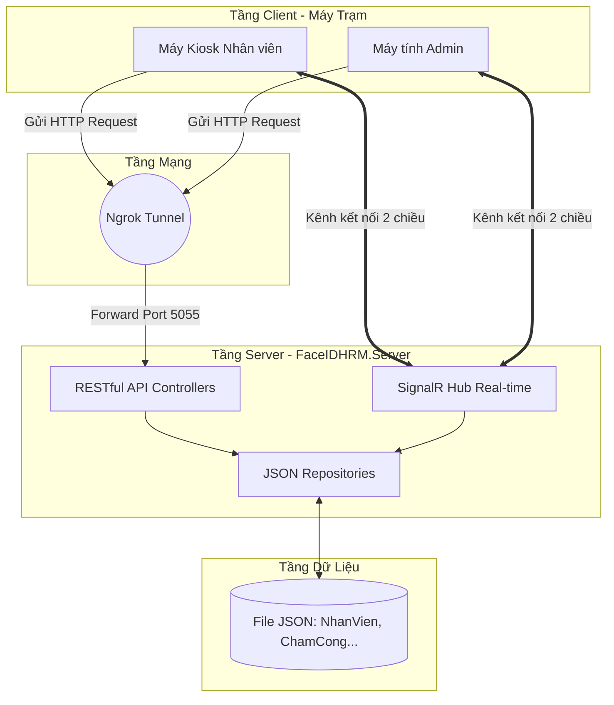
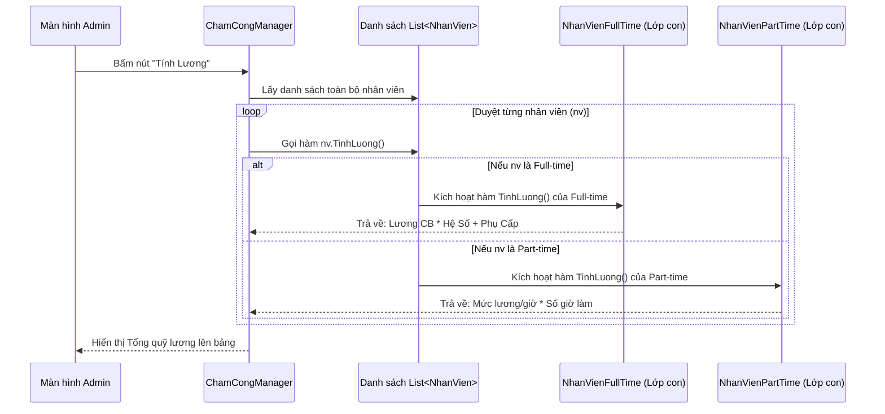

# Sơ Đồ Luồng (Flow Chart) Dự Án FaceIDHRM

Bạn có thể sử dụng các sơ đồ này để dán vào Slide PowerPoint hoặc báo cáo Word. Các sơ đồ này được vẽ bằng cú pháp Mermaid, bạn có thể copy đoạn code bên dưới paste vào trang web [Mermaid Live Editor](https://mermaid.live/) để xuất ra hình ảnh độ nét cao.

---

## 1. Sơ đồ Kiến trúc Hệ thống Tổng thể (System Architecture)
Mô tả cách Kiosk và Admin giao tiếp với Server thông qua Internet (Ngrok) và SignalR.



---

## 2. Sơ đồ Luồng Chấm Công Nhận Diện Khuôn Mặt (Attendance Flow)
Mô tả logic thông minh của Kiosk khi một nhân viên đứng trước Camera.

```mermaid
flowchart TD
    Start([Nhân viên đứng trước Camera]) --> FaceDetect{Camera nhận diện <br>thành công?}
    FaceDetect -- Không --> Start
    FaceDetect -- Có --> GetNV[Trích xuất Mã NV]
    
    GetNV --> CheckComplete{Hôm nay đã <br>hoàn thành ca làm <br>chưa?}
    
    CheckComplete -- Rồi --> Error1[Báo lỗi: Đã hoàn thành ca làm việc] --> End([Kết thúc])
    
    CheckComplete -- Chưa --> CheckOpen{Có ca nào đang mở <br>(đã Check-in, chưa Check-out) <br>không?}
    
    CheckOpen -- Không --> CheckIn[Khởi tạo Check-in mới]
    CheckIn --> PhanCa{Giờ hiện tại?}
    PhanCa -- Trước 12h30 --> Ca1[Xếp vào Ca 1]
    PhanCa -- Sau 12h30 --> Ca2[Xếp vào Ca 2]
    Ca1 --> SuccessCheckIn[Báo: Check-in thành công] --> End
    Ca2 --> SuccessCheckIn
    
    CheckOpen -- Có --> CheckTime{Đã hết giờ quy định <br>của ca làm chưa?}
    
    CheckTime -- Rồi --> CheckOut[Thực hiện Check-out] --> SuccessCheckOut[Báo: Check-out thành công] --> End
    
    CheckTime -- Chưa --> AskEarly{Hỏi: Bạn muốn xin<br>về sớm không?}
    AskEarly -- Không --> End
    AskEarly -- Có --> SendReq[Gửi Yêu cầu qua SignalR lên Admin]
    
    SendReq --> Waiting[Kiosk đóng băng, <br>Chờ Admin duyệt]
    Waiting --> AdminAction{Admin Quyết định?}
    AdminAction -- Từ chối --> Reject[Báo lỗi: Bị từ chối] --> End
    AdminAction -- Chấp nhận --> CheckOut
```

---

## 3. Sơ đồ OOP - Đa Hình Tính Lương (Polymorphism Flow)
Mô tả cách nguyên lý Đa Hình (Polymorphism) giải quyết bài toán tính lương.


